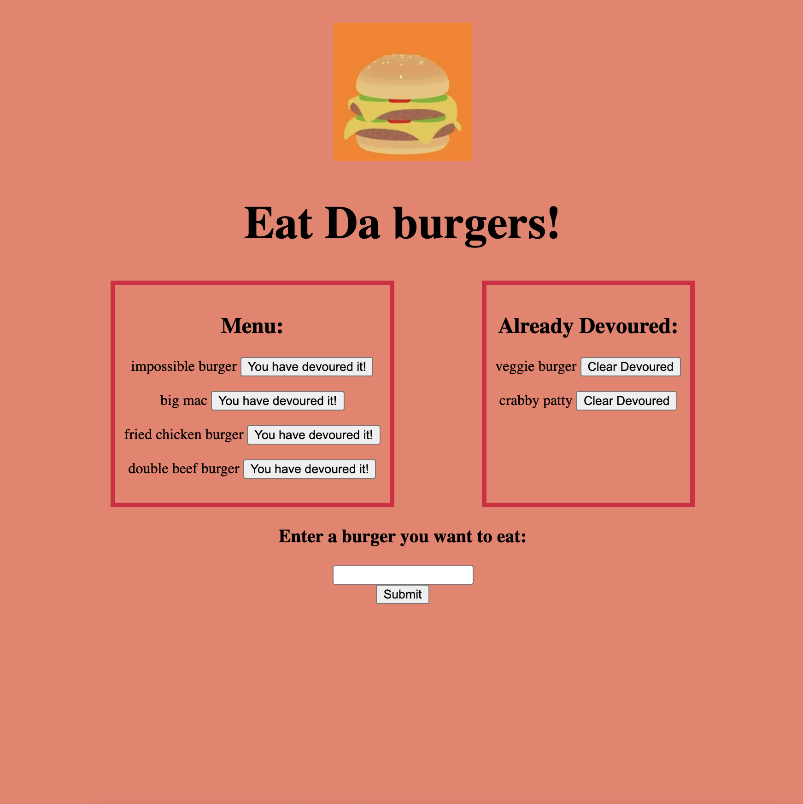

<h1 align="center">Eat all Da Burgers</h1>

## Application Description
This application is an intake logger for burgers. It has many uses, for restaurant owners, foodies, and the burger fanatics to track the brgers they have made, eaten or heard about.
This application used multiple npm packages included Node, Express, and MySQL which are used to handle the apps routes and database, and handlebars is used to generate the HTML webpage

## Table of Contents
- [Description](#description)
- [User Story](#user-story)
- [Technologies Used](#technologies-used)
- [License](#license)

💻 HTML generated:


🎥 Live Link:
[Live Link through Heroku](https://eatalldaburgers.herokuapp.com/)

## User Story

```
AS A USER, I want to track the amount of burgers I have devoured.
I WANT TO be able to add new burgers and delete old ones,
SO THAT I can track my diet, my taste buds, or my restaurants menu.

```

## Technologies Used

- CSS
- JQuery
- JavaScript
- Node.js
- Express - npm
- MySQL - npm
- Handlebars - npm

## License

Copyright <2021> 

Permission is hereby granted, free of charge, to any person obtaining a copy of this software and associated documentation files (the "Software"), to deal in the Software without restriction, including without limitation the rights to use, copy, modify, merge, publish, distribute, sublicense, and/or sell copies of the Software, and to permit persons to whom the Software is furnished to do so, subject to the following conditions:

The above copyright notice and this permission notice shall be included in all copies or substantial portions of the Software.

THE SOFTWARE IS PROVIDED "AS IS", WITHOUT WARRANTY OF ANY KIND, EXPRESS OR IMPLIED, INCLUDING BUT NOT LIMITED TO THE WARRANTIES OF MERCHANTABILITY, FITNESS FOR A PARTICULAR PURPOSE AND NONINFRINGEMENT. IN NO EVENT SHALL THE AUTHORS OR COPYRIGHT HOLDERS BE LIABLE FOR ANY CLAIM, DAMAGES OR OTHER LIABILITY, WHETHER IN AN ACTION OF CONTRACT, TORT OR OTHERWISE, ARISING FROM, OUT OF OR IN CONNECTION WITH THE SOFTWARE OR THE USE OR OTHER DEALINGS IN THE SOFTWARE.